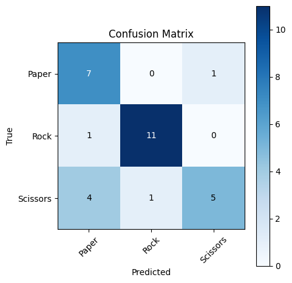
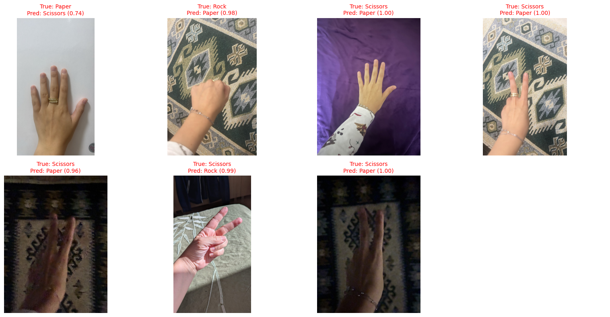
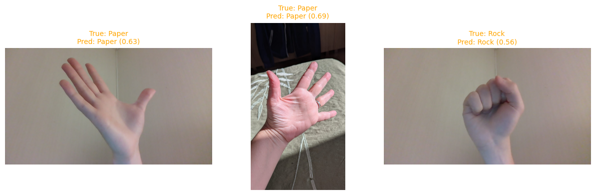
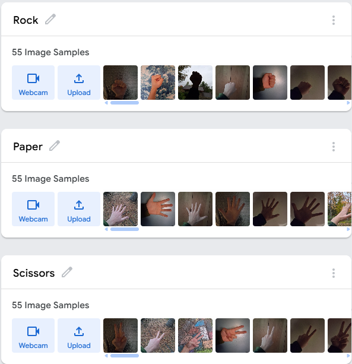
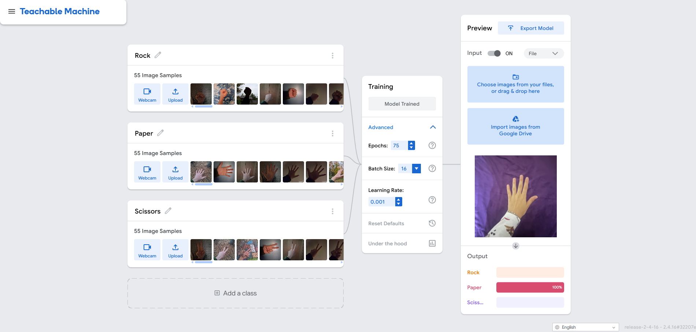
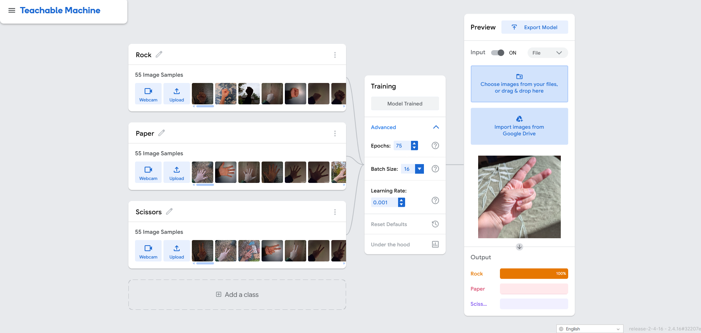
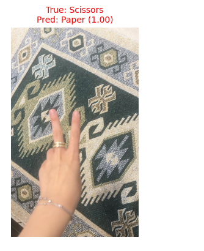

# Rock, Paper, Scissors - a Holberton project.
Holberton ML, Project 1. A Teachable Machine image classifier (rock / paper / scissors), tested on a test set collected by another group.

**Headline result:** 76.67% accuracy (23/30) on the swapped test set. Rock and paper mostly held up; scissors collapsed to 50%, with 4 of 10 scissors images called paper at 96 to 100% confidence.

**Authored by:** Blevis Allushi, with data collection assisted by K.M, E.K. (outside of Holberton)

**AI statement:** Claude Sonnet 5 at Medium effort was used for debugging assistance (needed for environment mismatches, package conflicts, partial notebook assistance) and structuring  `README.md`.

---

## 1. Data statement

*Drafted before any image collection.*

- **What I am collecting:** photographs of hands making three gestures: rock, paper, scissors.
- **Whose:** Consent and agreement for publication were provided by all persons whose data was collected, them being myself, my partner, and my mom (Hi👋).
- **Where it is stored:** this group repository, which is public.
- **Faces:** No face appears in any frame.
- **Would we be comfortable if this were published?** Yes. It's hands.

---

## 2. Training data

| Class | Images |
|---|---|
| Rock | 55 |
| Paper | 55 |
| Scissors | 55 |
| **Total** | **165** |

**What I varied or didn't vary:**
- Hands: mine, right
- Angles: straight on, tilted, from above, distance
- Light: window, room lights, spot lights, back lights, dark corner
- Backgrounds: walls, desk, clothes, plain, busy, textured, paintings, rugs (most highly varied)

**Model:** Teachable Machine, standard image model, 224x224 input. Exported as `Model/keras_model.h5` and `Model/labels.txt`.

---

## 3. Results on the swapped test set

Test set collected by me from pictures of the hands of my two subjects, different places/time of day from training.

Rows are the true class, columns are what the model said.

| | said rock | said paper | said scissors | row total |
|---|---|---|---|---|
| **actually rock** | **11** | 1 | 0 | 12 |
| **actually paper** | 0 | **7** | 1 | 8 |
| **actually scissors** | 1 | 4 | **5** | 10 |

**Accuracy: 23 / 30 = 76.67%**

| Class | Correct | Recall |
|---|---|---|
| Rock | 11 / 12 | 91.7% |
| Paper | 7 / 8 | 87.5% |
| Scissors | 5 / 10 | 50.0% |

Test set composition is 12 rock, 8 paper, 10 scissors (30 total).



**Confidence does not track correctness.** Of the 7 mistakes, 6 were made at 96% confidence or higher. Meanwhile 3 correct predictions came in below 75% (0.69, 0.63, 0.56). The model has no way to say "I am not sure", and its confidence score is not a reliability measure.

All 7 misclassified images:



Correct but low-confidence predictions:



**Error pattern:** 5 of the 7 mistakes are scissors (4 called paper, 1 called rock). The two non-scissors mistakes are one open hand on a white wall called scissors (74%) and one rock on a patterned rug called paper (98%).

---

## 4. Screenshots

1. **Class list with image counts:**



2. **Model working correctly:**



3. **Model confidently wrong:**



---

## 5. The single worst failure

`IMG-20260927-WA0038.jpg`: **true scissors, predicted paper at 99.99% confidence.**



The image shows two fingers raised and held close together, back of the hand toward the camera, on a green and beige patterned rug. The model treated it as an open hand.

What I think it latched onto: Model appears to read scissors as "two fingers clearly spread apart." The fingers are spread apart in paper as well. This leads me to believe the model errs toward paper moreso than scissors because it's more clearly identifiable, while scissors resemble partially both paper and rock. Secondly, the rug. Rugs appear in 4 of the 7 mistakes (this image, the rock called paper, and two dark, dim scissors shots that were also called paper). If no training image contains this rug, the model has never seen this background.

---

## 6. What the model actually learned

The model did not learn "rock, paper, scissors" as gestures. It learned something closer to "how spread out are the fingers in the silhouette," which separates rock from paper well but fails on scissors whenever the two raised fingers are held together or the hand is viewed from behind. Lighting and background also carry weight: the dim, dark-rug shots and the rug shots were the ones it got confidently wrong. The 96 to 100% confidence on those errors shows that the score reflects how familiar the pixels look, not whether the gesture is correct. To prove which factor mattered, I could re-shoot the same failed scissors gestures against a plain wall in good light, and separately re-test them at different finger spacings. (This is unrealistic because replicating the exact gesture, at the exact distance with the exact camera is pretty hard.)

---

## 7. Reproducing the evaluation

Teachable Machine `.h5` exports contain a nested Functional-in-Sequential structure and legacy layer configs (according to Claude) that Keras 3 cannot load (tried and failed), so this needs an older TensorFlow/Keras stack in its own environment (only working solution I found as of now).

```bash
conda create -n tm_legacy python=3.9 -y
conda activate tm_legacy
pip install -r requirements.txt
python -m ipykernel install --user --name tm_legacy --display-name "Python (tm_legacy)"
```

`requirements.txt`:

```
tensorflow==2.12.1
h5py==3.8.0
numpy==1.23.5
matplotlib==3.7.5
pillow==11.1.0
ipykernel
```

Folder layout expected by the notebook:

```
Model/     keras_model.h5, labels.txt, model_eval.ipynb
Testing/   rock/  paper/  scissors/   (labeled test images, one folder per class)
Training/  training images
```

Run `Model/model_eval.ipynb` top to bottom with the `tm_legacy` kernel. It loads the model, predicts the whole test set in one batch, prints accuracy, draws the confusion matrix, and plots every misclassified image with predicted vs true label.